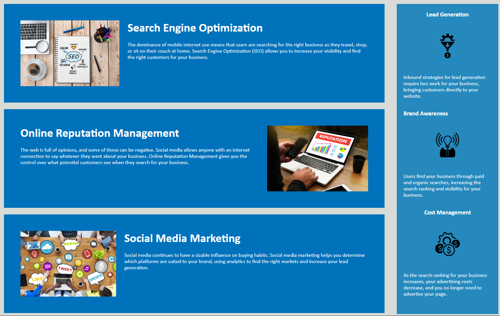

# Horiseon Refactor

## Description

Horiseon is a marketing agency that helps with Search Engine Optimization, Online Reputation Managment and Social Media Marketing. The website explains why each of these services are important and how Horiseon tackles these topics. The idea of this topic is help clients/customers understand the work behind marketing and why it is important. 

What I learned from building/refactoring this website is the importance of semantics. I changed most of the DIV tags to a more appropriate tag like section, header, footer, aside, figure etc. I also learned to include alt attributes for better accessibilites for all users. I built this project to help me understand efficient usage of semantics and descriptive details of each elements. 

## Installation

N/A

## Usage

1 - open to the page
2 - go to the navigation links on the header of the page. 
3 - click on the link so it can bring you to the approitate section.
4 - read content on the page.

[https://jjackielee.github.io/horiseon-refactor](https://jjackielee.github.io/horiseon-refactor)

## Credits

N/A

## License

N/A

---

## Features

When you click on the links on the top it will bring you to the appropriate section of the page. 

